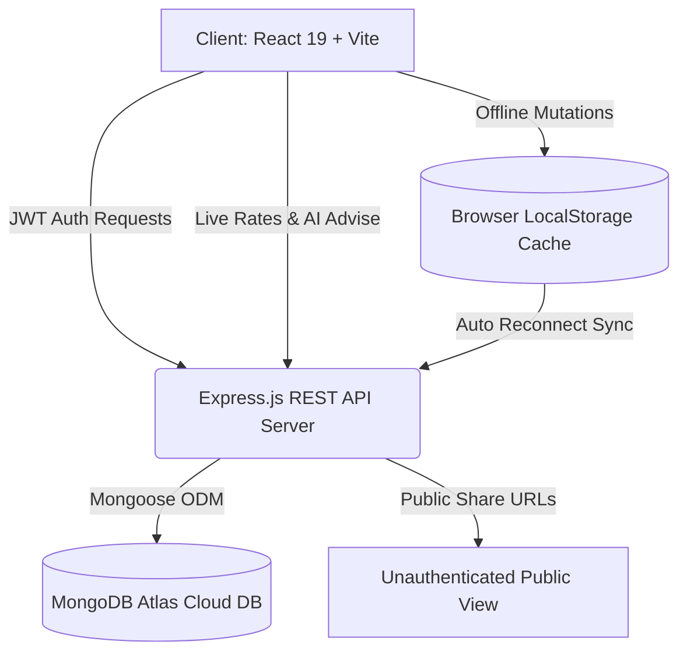

# 🌍 GlobeTrotter — Intelligent Multi-City Itinerary & Expense Planner

[](https://react.dev/)
[](https://vitejs.dev/)
[](https://nodejs.org/)
[](https://www.mongodb.com/)
[](https://jwt.io/)
[](LICENSE)

> **GlobeTrotter** is a real-time, deployment-ready multi-city travel planning platform designed to streamline complex itineraries, automate multi-currency expense accounting, provide destination-aware recommendations, and function resiliently offline with automatic cloud synchronization.

---

## 📸 Key Capabilities & Highlights

- ✈️ **Sequential Multi-City Routing**: Plan multi-stop journeys with interactive glowing timeline nodes, reorderable stops (`↑` / `↓`), and date range managers.
- 💰 **Real-Time Financial Command Center**: Combined manual expense tracker and booked activity costs with dynamic budget health thresholds (`<75% Green`, `75–90% Amber`, `>90% Red Alert`).
- 💱 **Multi-Currency Conversion Engine**: Live FX exchange rates across **7 world currencies** (`INR ₹`, `USD $`, `EUR €`, `GBP £`, `JPY ¥`, `CAD CA$`, `AUD A$`) with instant conversion across all metrics.
- 🏨 **Logistics & Inter-City Transit**: Comprehensive hotel reservation logs (with check-in/out, confirmation codes, paid status) and transit bookings (e.g. *Vande Bharat Express*, flights, rental cars, ferries).
- 🔗 **Public Itinerary Sharing & Cloning**: Instant unauthenticated public share links (`#share/:token`) with creator attribution and 1-click **"Clone Itinerary"** into traveler accounts.
- 💡 **Destination-Aware Recommendations**: Tailored curated activities for Western India (*Ahmedabad, Daman, Surat*) and global destinations (*Tokyo, Rome, Paris, Kyoto*) with 1-click addition to itineraries.
- 📶 **Zero-Error Offline Sync Engine**: Background mutation queue that buffers all offline edits and automatically syncs with MongoDB Atlas upon reconnection.
- 📄 **1-Click High-Quality PDF Export**: Download clean styled travel manifests or print directly using print-optimized layouts.
- ⚡ **1-Click Evaluator Demo Login**: Pre-seeded demo account (`demo@globetrotter.io`) with a complete *Gujarat Coastal Expedition: Ahmedabad to Daman* voyage.

---

## 🏛️ System Architecture



---

## 🛠️ Technology Stack

### Frontend (`/client`)
- **Core Framework**: React 19, Vite
- **State Management**: React Context API (`AuthContext`, `TripContext`)
- **Styling**: Vanilla CSS Design System with Modern Dark Glassmorphism, CSS Custom Properties, and responsive flex/grid layouts
- **Icons**: Lucide React
- **Export Engine**: `html2pdf.js`, `@media print` stylesheets
- **Offline Engine**: Navigator Online API, Mutation Queue, LocalStorage Cache

### Backend (`/server`)
- **Runtime**: Node.js & Express.js
- **Database**: MongoDB Atlas via Mongoose ODM
- **Authentication**: JSON Web Tokens (JWT) & bcryptjs password hashing
- **Security**: CORS, environment separation via `dotenv`
- **Modules**: Auth, Trips, Stops, Activities, Expenses, Budgeting, Logistics, Currency Rates, Recommendations

---

## 🚀 Getting Started & Installation

### Prerequisites
- **Node.js** (v18 or higher)
- **npm** or **yarn**
- Active **MongoDB Atlas** cluster connection URI (or local MongoDB)

### 1. Clone & Setup Workspace
```bash
git clone https://github.com/your-username/globetrotter.git
cd globetrotter
```

### 2. Backend Setup (`/server`)
1. Open terminal in `server/`:
   ```bash
   cd server
   npm install
   ```
2. Create a `.env` file in `server/`:
   ```env
   PORT=5000
   MONGO_URI=your_mongodb_connection_string
   JWT_SECRET=globetrotter_secret_jwt_key_2026
   ```
3. Start the backend server:
   ```bash
   npm start
   ```
   *Server runs at `http://localhost:5000` and automatically connects to MongoDB Atlas.*

### 3. Frontend Setup (`/client`)
1. Open a new terminal in `client/`:
   ```bash
   cd client
   npm install
   ```
2. Start the Vite development server:
   ```bash
   npm run dev
   ```
   *Frontend opens at `http://localhost:3000` (or `http://localhost:5173`).*

---

## 📡 REST API Reference

### Authentication (`/api/auth`)
| Method | Endpoint | Description | Protected |
| :--- | :--- | :--- | :--- |
| `POST` | `/api/auth/register` | Register a new traveler account | No |
| `POST` | `/api/auth/login` | Login with email and password | No |
| `POST` | `/api/auth/demo` | 1-Click Demo Login (`demo@globetrotter.io`) | No |
| `GET` | `/api/auth/me` | Fetch authenticated user profile | Yes |
| `PUT` | `/api/auth/profile` | Update profile, display name, avatar, and currency | Yes |

### Trips & Itineraries (`/api/trips`)
| Method | Endpoint | Description | Protected |
| :--- | :--- | :--- | :--- |
| `GET` | `/api/trips` | Get all trips for the authenticated user | Yes |
| `POST` | `/api/trips` | Create a new trip | Yes |
| `GET` | `/api/trips/:id` | Get trip by ID | Yes |
| `PUT` | `/api/trips/:id` | Update trip title, dates, or cover | Yes |
| `DELETE` | `/api/trips/:id` | Delete trip and all child entities | Yes |
| `GET` | `/api/trips/share/:token` | Public unauthenticated itinerary view | No |
| `POST` | `/api/trips/clone/:token` | Duplicate shared trip into user account | Yes |

### Stops & Activities
| Method | Endpoint | Description | Protected |
| :--- | :--- | :--- | :--- |
| `POST` | `/api/trips/:id/stops` | Add a new city stop to itinerary | Yes |
| `PUT` | `/api/trips/:id/stops/reorder` | Reorder sequential city stops | Yes |
| `PUT` | `/api/trips/:id/stops/:stopId` | Update stop dates & budget allocation | Yes |
| `DELETE` | `/api/trips/:id/stops/:stopId` | Remove city stop | Yes |
| `POST` | `/api/trips/:id/stops/:stopId/activities` | Add planned activity to city stop | Yes |
| `PATCH` | `/api/trips/:id/stops/:stopId/activities/:actId/toggle-booking` | Toggle activity booking status | Yes |

### Financials, Logistics & Currency
| Method | Endpoint | Description | Protected |
| :--- | :--- | :--- | :--- |
| `POST` | `/api/trips/:id/expenses` | Log a manual expense with category & payment | Yes |
| `PATCH` | `/api/trips/:id/budget` | Set overall trip target budget & currency | Yes |
| `PUT` | `/api/trips/:id/stops/:stopId/accommodation` | Save hotel reservation & confirmation code | Yes |
| `POST` | `/api/trips/:id/transports` | Add inter-city transit (train, flight, cab, ferry) | Yes |
| `GET` | `/api/currency/rates` | Fetch real-time exchange rates (7 currencies) | No |
| `GET` | `/api/recommendations/:city` | Get curated recommendations for a destination | No |

---

## 🧑‍⚖️ Evaluation & Testing Guide for Hackathon Judges

### 1. 1-Click Demo Evaluation
1. Open the application in your browser.
2. In the Authentication Modal or Navbar, click **"1-Click Demo Voyager"**.
3. You will instantly be logged in as `demo@globetrotter.io` with a pre-loaded trip: **"Gujarat Coastal Expedition: Ahmedabad to Daman"**.

### 2. Testing Multi-City Timeline & Reordering
1. Click **"Manage Trip"** on the Gujarat expedition card.
2. In the **Visual Timeline** tab, view the sequential route (*Ahmedabad ➔ Daman*).
3. Switch to **Stop Cards** tab and click `↑` / `↓` to test live sequence reordering in MongoDB.

### 3. Testing Public Sharing
1. In the header toolbar next to "Export PDF", click the cyan **"Share"** button.
2. Click **"Copy Link"** or **"Open Public View"**.
3. Open the link (e.g. `http://localhost:3000/#share/gt-share-...`) in an **Incognito / Private Window**.
4. Notice the clean unauthenticated public view with creator badge and **"Clone Itinerary"** button.

### 4. Testing Logistics & Stays
1. Click the **"Logistics & Stays"** tab in the trip details view.
2. Check hotel booking cards (*The House of MG Heritage Suite*) with confirmation code `HMG-9821-OK` and confirmed status.
3. Switch to **Transit & Logistics** sub-tab to view inter-city train details (*Vande Bharat Express Ahmedabad to Vapi/Daman*).

### 5. Testing Offline Resilience
1. Open your browser DevTools (<kbd>F12</kbd>) ➔ **Network** tab ➔ set throttling to **Offline**.
2. Notice the Navbar badge immediately changes to **"Offline Mode • Cache Protected"**.
3. Add a new activity or expense — all updates will save locally without errors.
4. Set Network back to **Online** — the sync engine will automatically replay mutations and display **"Cloud Synced ✓"**!

---

## 📜 License

This project is licensed under the MIT License — see the [LICENSE](LICENSE) file for details.

---

*Crafted with ❤️ for the Odoo LDCE Hackathon 2026.*
